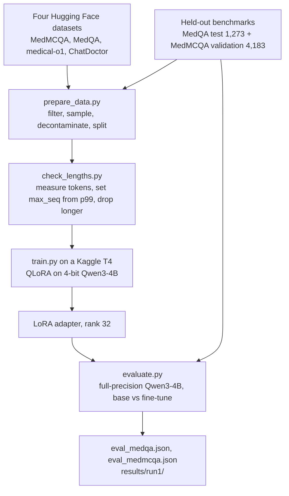

# Qwen3-4B medical fine-tune

Qwen3-4B fine-tuned with QLoRA for medical question answering, on one free
Kaggle T4 GPU. The training mix has exam multiple-choice questions and patient
conversations. The evaluation compares the fine-tuned adapter with the base
model on 5,456 exam questions that training never saw.

This is an educational project. It is not a medical device and not medical
advice, and the model can give wrong answers.

## Status

| Stage | State |
|---|---|
| Training | Done. One run on 2026-09-21 produced the LoRA adapter (run 1). |
| Evaluation | Done on 2026-09-24: 5,456 held-out questions on a Kaggle T4, in 1.2 hours. |
| Result | A small gain when choosing among the answer letters; worse when writing answers out, mostly from answer length and format. See below. |
| Run 2 | Done 2026-09-26: a reasoning fine-tune on 13,617 examples. Letter choice +0.8 pooled (PubMedQA +3.1, significant); the fine-tune learned to skip thinking. See below. |
| Run 3 | Running on Kaggle since 2026-09-26 17:34 UTC: run 2's data with /think and /no_think in every prompt. |
| Chat frontend | Planned, not built. |

## Result

The base Qwen3-4B against the fine-tune, on questions training never saw. p is
an exact McNemar test on the paired answers.

| Benchmark | Scoring | n | Base | Fine-tune | Change | Wins / regressions | p |
|---|---|---:|---:|---:|---:|---:|---:|
| MedQA-USMLE test | answer choice | 1,273 | 56.6% | 58.8% | +2.1 | 112 / 85 | 0.064 |
| MedMCQA validation | answer choice | 4,183 | 53.8% | 55.4% | +1.6 | 399 / 334 | 0.018 |
| MedQA-USMLE test | written answer | 300 | 68.7% | 62.3% | −6.3 | 19 / 38 | 0.016 |
| MedMCQA validation | written answer | 300 | 57.7% | 42.7% | −15.0 | 22 / 67 | 0.000002 |

- **Answer-choice scoring**, the headline, shows a small gain on both
  benchmarks. It is significant on MedMCQA (p = 0.018) and not on MedQA
  (p = 0.064). The MedMCQA gain does not come from guessing A: the fine-tune
  picked A 1,176 times against the base model's 1,499, with 1,348 correct As.
- **Written answers** are worse, and mostly for reasons of format, not
  knowledge. On MedMCQA, 70 of the fine-tune's 300 answers ran past the
  512-token cap before stating a letter (the base: 0). On the 230 questions
  where neither model hit the cap, they score alike: 56.5% and 55.7%. On MedQA
  the fine-tune answers at once, as it was trained to (median 9 characters),
  while the base model reasons first (median 884 characters), and reasoning
  first wins here.

So the fine-tune knows slightly more when asked to pick a letter, and it has
learned an answer format that costs it when it must write the answer out. The
full reports, with every question's prediction from both models, are
[`results/run1/eval_medqa.json`](results/run1/eval_medqa.json) and
[`results/run1/eval_medmcqa.json`](results/run1/eval_medmcqa.json).
[`docs/evaluation.md`](docs/evaluation.md) lists the caveats that go with these
numbers.

## How it works



1. `prepare_data.py` samples four datasets, drops rows that cannot teach (for
   example MedMCQA rows whose explanation is under 80 characters), and removes
   any training row whose question appears in either benchmark or earlier in
   the training set.
2. `check_lengths.py` tokenizes every example, sets `max_seq` from the 99th
   percentile, and drops longer examples instead of truncating them mid-answer.
3. `train.py` trains a rank-32 LoRA adapter on Unsloth's 4-bit Qwen3-4B, with
   loss on the response only. At step 50 it projects the total run time and
   stops the run if the projection exceeds 6 hours.
4. `evaluate.py` loads the full-precision Qwen3-4B once, attaches the adapter,
   and scores the base (adapter switched off) and the fine-tune on identical
   prompts, two ways: the logit of each answer letter, and greedy generation.

## Run 1 at a glance

The figures come from [`results/run1/`](results/run1/), which keeps the stats,
the data report, the loss curve, and the exact notebook that trained the
adapter with its output. The adapter size is from [`TODO.md`](TODO.md).

| | |
|---|---|
| Base model trained | `unsloth/Qwen3-4B-unsloth-bnb-4bit` |
| Examples requested | 18,000 |
| Examples trained | 17,285 (90 removed by decontamination, 500 kept for validation, 125 over-length) |
| Mix, before the length drop | 69.9% exam and reasoning, 30.1% patient dialogue |
| Held out, never trained on | 5,456 (1,273 MedQA test + 4,183 MedMCQA validation) |
| `max_seq` | 960 tokens, from a measured p99 of 929 |
| Steps | 541 at an effective batch of 32 |
| Runtime | 17,332 s (4.81 h) on one T4, 0.997 examples/s |
| Mean training loss | 1.796 (2.912 at the first logged step) |
| Adapter | LoRA rank 32, alpha 32, on the q, k, v, o, gate, up and down projections; 264 MB |

The adapter weights are not in the repository: `training/outputs/` is ignored
by git. [`docs/training.md`](docs/training.md) explains each row.

## Data and models

| Hugging Face id | Used as | Run 1 request |
|---|---|---|
| [`openlifescienceai/medmcqa`](https://huggingface.co/datasets/openlifescienceai/medmcqa) | training (train split): multiple choice with a written explanation; benchmark (validation split) | 6,300 |
| [`GBaker/MedQA-USMLE-4-options`](https://huggingface.co/datasets/GBaker/MedQA-USMLE-4-options) | training (train split): multiple choice on long clinical vignettes; benchmark (test split) | 3,700 |
| [`FreedomIntelligence/medical-o1-reasoning-SFT`](https://huggingface.co/datasets/FreedomIntelligence/medical-o1-reasoning-SFT) | training (`en` config): free-text answers with chain of thought | 2,600 |
| [`lavita/ChatDoctor-HealthCareMagic-100k`](https://huggingface.co/datasets/lavita/ChatDoctor-HealthCareMagic-100k) | training: patient questions and doctor replies | 5,400 |
| [`unsloth/Qwen3-4B-unsloth-bnb-4bit`](https://huggingface.co/unsloth/Qwen3-4B-unsloth-bnb-4bit) | the 4-bit base the adapter was trained on | |
| [`unsloth/Qwen3-4B`](https://huggingface.co/unsloth/Qwen3-4B) | the full-precision base the evaluation scores | |
| [`Qwen/Qwen3-0.6B`](https://huggingface.co/Qwen/Qwen3-0.6B) | the small model the local smoke test runs on | |

Each dataset and model has its own terms of use. Read its card before you
reuse it.

## Run 2 result

Run 2 trained in Qwen3's thinking format on 13,617 examples from eight sources
and was scored in the same Kaggle session. Base against fine-tune, exact
McNemar p:

| Benchmark (letter choice, all questions) | n | Base | Fine-tune | Change | p |
|---|---:|---:|---:|---:|---:|
| MedQA-USMLE test | 1,273 | 57.4% | 58.1% | +0.6 | 0.61 |
| MedMCQA validation | 4,183 | 55.0% | 55.3% | +0.3 | 0.66 |
| PubMedQA labeled | 1,000 | 72.0% | 75.1% | +3.1 | 0.008 |
| MMLU medical | 1,089 | 73.3% | 74.1% | +0.8 | 0.45 |
| All four, pooled | 7,545 | 60.3% | 61.1% | +0.8 | 0.067 |

Reasoning mode could be compared on only 192 MedQA questions: base 68.2%,
fine-tune 57.8% (p = 0.004). Two things went wrong there:

- **The fine-tune mostly stopped thinking.** It wrote a real reasoning trace on
  302 of 1,273 MedQA questions (median 15 new tokens) and otherwise answered at
  once, so its reasoning-mode score (56.8%) equals its letter-choice score. The
  cause is the data format: the 25% of direct-answer rows carried their empty
  think block inside the trained answer, under the same system prompt as the
  reasoning rows, so the model learned to choose "no thinking" itself for
  exam-style questions. Qwen3's intended signal is `/no_think` in the prompt.
- **The base model's evaluation worker ran out of GPU memory** after 192
  questions: it thinks at length (median 1,025 tokens), and the budget-forcing
  pass re-read 16 prompts of up to ~2,500 tokens at once on a 15 GB T4. The
  fine-tune's worker finished; its reasoning-mode scores without a base to
  compare against are MedQA 56.8% (1,273), MMLU-medical 71.2% (1,089),
  PubMedQA 74.6% (500) and MedMCQA 51.6% (304).

Full numbers: [`results/run2/run2_eval.json`](results/run2/run2_eval.json);
every answer from both models: [`results/run2/predictions/`](results/run2/predictions/).

## Evaluation

Both benchmarks are the exact sets that training was decontaminated against.
The base model and the fine-tune see the same prompts and the same greedy
decoding, and come from one model load.

- Constrained scoring reads the logits of the four answer letters after
  `Answer:`, on all 5,456 questions. This is the headline number.
- Generative scoring decodes a full answer and extracts the stated letter, on
  the first 300 questions of each benchmark.
- Each mode reports accuracy for both models, wins and regressions, an exact
  McNemar p-value on the paired outcomes, and accuracy per subject.

[`docs/evaluation.md`](docs/evaluation.md) covers the method, the report
format, the notebook's gates and the biases to keep in mind when reading the
result.

## Repository layout

| Path | Contents |
|---|---|
| `training/` | the Python package: data preparation, training, evaluation, and the training notebook with its Kaggle metadata |
| `evaluation/` | the evaluation notebook and its Kaggle metadata |
| `scripts/` | the notebook builder, the Kaggle upload and push scripts, and the local smoke test |
| `tests/` | the pytest suite |
| `results/run1/` | what run 1 measured, and the notebook and output that produced it |
| `docs/` | these guides; `docs/superpowers/` holds the design spec and the implementation plans |
| `TODO.md` | where the project stands and what is left |

| Module in `training/` | Role |
|---|---|
| `records.py` | `Record`, the one example type all four sources normalise into |
| `sources.py` | the four loaders and their filters, with seeded sampling |
| `prompts.py` | system prompts, prompt rendering and answer extraction, shared by training and evaluation |
| `prepare_data.py` | builds `train.jsonl` and `val.jsonl`, decontaminated against both benchmarks |
| `check_lengths.py` | measures token lengths, suggests `max_seq`, drops over-length examples |
| `budget.py` | the step-50 run-time projection |
| `train.py` | QLoRA training with Unsloth and TRL |
| `evalcore.py` | accuracy, exact McNemar and the per-subject breakdown |
| `evaluate.py` | scores base against fine-tune and writes the report JSON |
| `modeling.py` | device and precision choice, and model loading without Unsloth |
| `kaggle_paths.py` | finds the uploaded code and adapter on Kaggle, and fingerprints the code |

## Quick start

The project uses Python 3.12 locally. The test suite needs no GPU and no
network:

```bash
python3 -m venv .venv
.venv/bin/pip install -r requirements-dev.txt
.venv/bin/python -m pytest
```

The smoke test runs the whole evaluation path on `Qwen/Qwen3-0.6B` with a small
random adapter, on the CPU. Its first run downloads the model, about 1.5 GB:

```bash
.venv/bin/pip install -r requirements-smoke.txt
.venv/bin/python scripts/smoke_eval.py
```

Training uses Unsloth and runs only on Kaggle in this project. To reproduce
either run on your own Kaggle account, follow [`docs/kaggle.md`](docs/kaggle.md).

## Chat frontend

A chat frontend is planned and not built. The plan is
[`docs/superpowers/plans/2026-09-24-serving-and-frontend.md`](docs/superpowers/plans/2026-09-24-serving-and-frontend.md):
a FastAPI server that runs a safety screen on each message and sends its
result before the answer, and a Next.js app to ask questions in and read the
evaluation from.

## Documentation

- [`docs/training.md`](docs/training.md): data, decontamination, prompt format,
  sequence length, the QLoRA setup, the budget probe, what run 1 measured, and
  the Kaggle attempts that failed before it
- [`docs/evaluation.md`](docs/evaluation.md): what is measured and how, the
  report JSON, the Kaggle notebook's gates, known biases, and running it locally
- [`docs/kaggle.md`](docs/kaggle.md): reproducing both runs on your own Kaggle
  account, and a catalogue of failures with the guard for each
- [`docs/superpowers/specs/2026-09-20-medical-llm-finetune-design.md`](docs/superpowers/specs/2026-09-20-medical-llm-finetune-design.md):
  the design, written before implementation. Some of its numbers changed
  later (it plans 40,000 training examples; run 1 requested 18,000). Where the
  spec and the code disagree, the code and `results/run1/` describe what ran.
- [`docs/superpowers/plans/`](docs/superpowers/plans/): the implementation plans
  for training, evaluation, and serving with the frontend
- [`TODO.md`](TODO.md): status and remaining work
